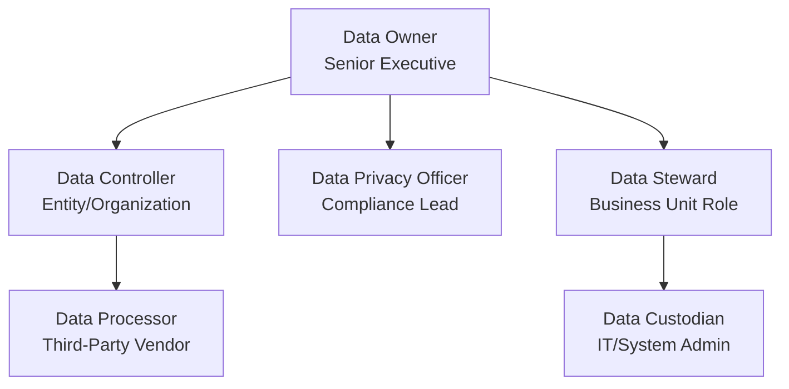

Of course! Here are structured study notes on Data Ownership and Roles, based on the provided lesson.

---

### **Data Ownership & Roles Study Notes**

#### **1. Core Concept: Data Ownership**

*   **Definition:** The process of identifying the person responsible for the **confidentiality, integrity, availability, and privacy** of information assets.
*   **Key Idea:** Data ownership in an enterprise is **not** about who created a file. It is a framework of formal roles and responsibilities.

---

#### **2. Key Roles and Responsibilities**

Here is a breakdown of the critical roles involved in data management and protection, visualized in a hierarchy of responsibility:

*   **Data Owner**
    *   **Who:** A **Senior Executive** (e.g., department head, CFO).
    *   **Responsibility:** Has **ultimate responsibility** for the data asset.
    *   **Key Tasks:**
        *   **Labeling and Classifying** data (e.g., "this is Financial Information").
        *   Defining the **protection requirements and controls** for each classification.

*   **Data Controller**
    *   **Who:** The **entity or organization** that collects the data.
    *   **Responsibility:** Decides the **why** (purpose) and **how** (methods) of data collection, storage, and usage.
    *   **Accountability:** Holds **ultimate, non-delegable accountability** for data privacy and any breaches.

*   **Data Processor**
    *   **Who:** A **third-party** or individual hired by the controller (e.g., cloud provider, payroll service).
    *   **Responsibility:** Performs data tasks (collection, storage, analysis) **on behalf of and under the instructions of** the Data Controller.

*   **Data Steward**
    *   **Who:** A role that works for the Data Owner, often within a business unit.
    *   **Responsibility:** Focused on **data quality and metadata**.
    *   **Key Task:** Ensures the Data Owner's policies are implemented correctly, such as making sure data is **appropriately labeled and classified**.

*   **Data Custodian**
    *   **Who:** **IT Personnel** (e.g., System Administrators).
    *   **Responsibility:** Manages the **technical systems** where data is stored.
    *   **Key Tasks:** Implements and enforces the technical controls defined by the Data Owner, such as **access control, encryption, and backups**.

*   **Data Privacy Officer**
    *   **Who:** A specialized role focused on compliance.
    *   **Responsibility:** Oversight of all **privacy-related data** (PII, SPI, PHI).
    *   **Key Tasks:**
        *   Ensures compliance with legal/regulatory frameworks (e.g., GDPR, HIPAA).
        *   Manages **data purpose, minimization, sovereignty, and retention**.
        *   Heavily involved in the event of a **data breach**.

---

#### **3. Critical Insight: Who Should Own the Data?**

*   **The Problem:** Many organizations incorrectly make the CIO or IT department the Data Owner.
*   **The Solution:**
    *   **IT personnel should be Data Custodians, not Data Owners.**
    *   The **Data Owner must be a business leader** (e.g., CFO for financial data, Head of Software Development for source code).
    *   **Why?** Business leaders understand the **context, value, and sensitivity** of the data, enabling them to make correct classification and protection decisions.

---

### **Key Takeaways & Mnemonics**

*   **Chain of Responsibility:**
    *   **Owner:** Says *"This data is confidential."*
    *   **Steward:** Ensures *"All this data is labeled 'confidential.'"*
    *   **Custodian:** Implements *"Only the 'Confidential' group has access."*
    *   **Controller:** Is legally accountable for *"Why we collected it and how it's used."*
    *   **Processor:** Is the vendor *"Processing it as instructed."*
    *   **Privacy Officer:** Ensures *"This entire process is legal and ethical."*

*   **IT's Role:** **Custodian, not Owner.** We manage the systems, not the business context of the data.

*   **Exam Focus:** Be able to distinguish between these roles, especially:
    *   **Data Owner** (Business Executive) vs. **Data Custodian** (IT Admin).
    *   **Data Controller** (Accountable Entity) vs. **Data Processor** (Contracted Vendor).

