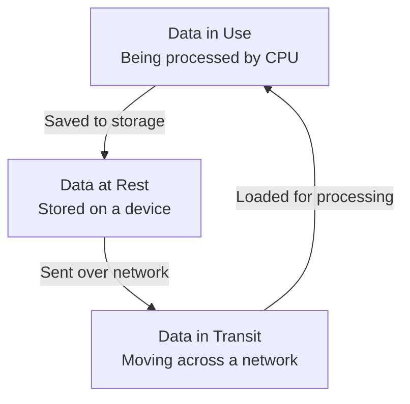

### **Data States

#### **1. Core Concept: The Three Data States**

Data exists in three primary states throughout its lifecycle. Each state is vulnerable to different threats and requires specific security measures.

---

#### **2. Data at Rest**

*   **Definition:** Data that is **stored statically** on a device or medium. It is not actively moving.
*   **Examples:** Data on hard drives, servers, databases, USB drives, and file systems.
*   **Primary Threat:** Unauthorized access or physical theft of the storage medium.
*   **Primary Protection Method:** **Encryption**. This ensures that even if the data is accessed, it cannot be read without the decryption key.

| Encryption Type | Description | Common Example |
| :--- | :--- | :--- |
| **Full Disk Encryption (FDE)** | Encrypts the entire storage drive. Data is decrypted when the system is on and user is logged in. | BitLocker, FileVault |
| **Partition Encryption** | Encrypts only a specific partition or drive letter. | Encrypting the `D:` drive on a workstation. |
| **File Encryption** | Encrypts individual files. | A single spreadsheet containing passwords. |
| **Volume / Folder Encryption**| Encrypts a specific set of files or directories. | Encrypting the `C:\Projects` folder. |
| **Database Encryption** | Encrypts data within a database. Can be applied at the table, row, or column level. | Encrypting a "Salary" column in a HR database. |
| **Record Encryption** | Encrypts specific fields within a database record. | Encrypting social security numbers within an employee record. |

---

#### **3. Data in Transit (Data in Motion)**

*   **Definition:** Data that is **actively moving** from one location to another across a network.
*   **Examples:** Web browsing, sending an email, transferring files, API calls.
*   **Primary Threat:** Interception, eavesdropping, or man-in-the-middle (MiTM) attacks.
*   **Primary Protection Method:** **Communication Encryption & Tunneling**.
	
	

| Protection Method | Description | Common Use Case |
| :--- | :--- | :--- |
| **TLS/SSL** | Cryptographic protocols that provide secure communication over a network. (TLS is the modern replacement for SSL). | **HTTPS** websites, secure email. |
| **VPN (Virtual Private Network)** | Creates a secure, encrypted "tunnel" over a public (untrusted) network like the internet. | Remote employees accessing the corporate network. |
| **IPSec (Internet Protocol Security)** | A protocol suite that authenticates and encrypts each IP packet in a data stream. | Secure site-to-site network connections. |

---

#### **4. Data in Use**

*   **Definition:** Data that is **actively being processed** by a computer's CPU. It is in memory (RAM) or temporary storage.
*   **Examples:** Creating a document, editing a spreadsheet, querying a database, loading a webpage.
*   **Primary Threat:** Unauthorized access from other processes on the system, memory scraping malware.
*   **Primary Protection Challenge:** Data must be decrypted to be processed, making it temporarily vulnerable.
*   **Protection Methods:**
    *   **Access Controls:** Strict permissions defining who can use the data and which applications can process it.
    *   **Application-Level Encryption:** The application itself handles encryption/decryption during processing.
    *   **Secure Enclaves:** A protected, isolated area of the processor (e.g., Intel SGX) where data can be processed securely, shielded from other parts of the system.
    *   **Memory Encryption:** Technologies that can encrypt data while it resides in RAM.

---

### **Key Takeaways & Mnemonics**

*   **The Three States:** **At Rest** (Storage), **In Transit** (Network), **In Use** (Processing).
*   **Protection Summary:**
    *   **At Rest -> Storage Encryption** (FDE, File, Database)
    *   **In Transit -> Communication Encryption** (TLS, VPN, IPSec)
    *   **In Use -> Process & Access Control** (Permissions, Secure Enclaves)

*   **Why Data in Use is Hard to Protect:** It must be unencrypted for the CPU to understand it, creating a brief window of vulnerability.

*   **Exam Focus:** Be able to match the data state with the correct primary security control. For example, a question about securing a file on a laptop points to **Data at Rest** and **Encryption**, while a question about securing web traffic points to **Data in Transit** and **TLS**.