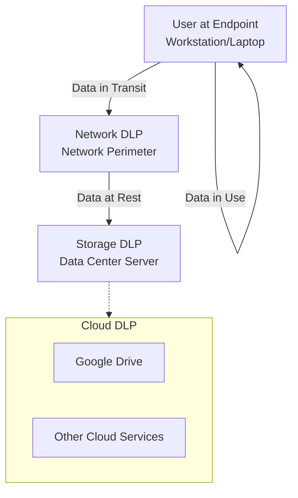

Of course! Here are structured study notes on Data Loss Prevention (DLP), based on the provided lesson.

---

### **Data Loss Prevention (DLP) Study Notes**

#### **1. Core Concept: What is DLP?**

*   **Definition:** A set of tools and processes designed to **detect and prevent unauthorized data exfiltration** (data leaving the organization).
*   **Purpose:** To monitor and protect data in all three states: **in use, in transit, and at rest**.
*   **Analogy:** Functions like an **IDS/IPS**, but is specifically focused on monitoring and protecting the **data itself** based on predefined policies.

---

#### **2. The Evolution of Data Theft (Why DLP is Needed)**

Data theft has evolved, making it easier to steal vast amounts of information:

1.  **Physical Files:** Required a physical break-in; theft was limited by what one could carry.
2.  **Laptops:** Theft of a device meant loss of all data stored on it.
3.  **External Hard Drives:** Could hold large amounts of data, but were bulky and somewhat detectable.
4.  **Thumb Drives (USB):** Small, easily concealed, and can hold massive amounts of data.
5.  **Cloud Storage (e.g., Dropbox, Google Drive):** The modern threat; allows for the exfiltration of terabytes of data over the network without any physical theft.

**Conclusion:** Intellectual property is the "currency" of business, and DLP is essential to protect it.

---

#### **3. The Four Types of DLP Systems**

DLP systems can be deployed in different areas of the IT environment to provide comprehensive coverage.

| DLP Type | Deployment | What It Monitors | Key Function |
| :--- | :--- | :--- | :--- |
| **Endpoint DLP** | Software installed on **workstations/laptops**. | **Data in Use** | Monitors user actions on the device (e.g., file transfers to USB). Can **block** actions or **alert** admins. |
| **Network DLP** | Hardware/software appliance at the **network perimeter**. | **Data in Transit** | Inspects all traffic entering/leaving the network, with a special focus on **outbound** traffic to detect data exfiltration. |
| **Storage DLP** | Software installed on **servers** in the data center. | **Data at Rest** | Inspects data on servers. Detects unusual access patterns (e.g., large downloads at 2 AM) and ensures compliance with policies. |
| **Cloud DLP** | **Software-as-a-Service (SaaS)** offering. | **Data in Cloud Services** | Protects data stored within cloud storage platforms (e.g., Google Drive, Microsoft 365) as part of the cloud service itself. |

---

#### **4. Operational Modes**

*   **Detection Mode:** Monitors and generates alerts when a policy is violated, but does not block the activity.
*   **Prevention Mode:** Actively blocks the data transfer or user action when a policy violation is detected.

---

### **Key Takeaways & Mnemonics**

*   **The Goal of DLP:** **Stop data from leaving the organization** intentionally or unintentionally.
*   **Coverage:** A comprehensive DLP strategy uses multiple types to protect data in **all three states** (in use, in transit, at rest).
*   **The Modern Threat:** **Cloud services** represent a major exfiltration channel, making **Cloud DLP** essential.
*   **Analogy:** Think of DLP as a **bouncer** for your data, checking its credentials (based on policies) before letting it leave the premises.