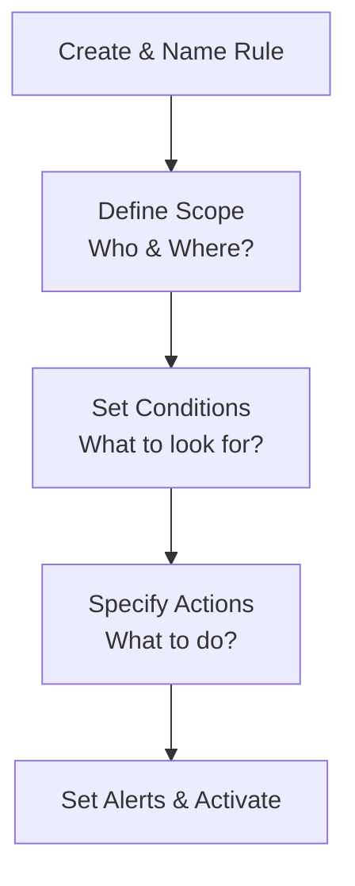

Of course! Here are structured study notes based on the DLP configuration lesson, focusing on the key concepts and processes.

---

### **Configuring Data Loss Prevention (DLP) - Study Notes**

#### **1. Core Concept & Purpose**

*   **Goal:** To prevent sensitive data from being exfiltrated through organizational communication and storage channels.
*   **Channels Covered:** This demonstration covered DLP for:
    *   **Google Drive** (cloud storage)
    *   **Google Chat** (instant messaging)
    *   **Gmail** (email)
*   **Universal Principle:** The process is similar across major platforms (e.g., Google Workspace, Microsoft 365). Focus on understanding the **concepts**, not just the specific clicks.

---

#### **2. DLP Configuration Workflow**

The process of setting up a DLP rule follows a logical sequence, from defining what to protect to deciding what happens when a violation occurs.

##### **Step 1: Create and Name the Rule**
*   **Action:** Create a new rule and give it a clear, descriptive name.
*   **Example:** `"Block SSNs"`
*   **Best Practice:** Include a clear description (e.g., "Prevent SSNs from being shared in Chat or Drive").

##### **Step 2: Define the Scope**
*   **Action:** Determine **who** the rule applies to.
*   **Options:**
    *   **Everyone:** For universally sensitive data (e.g., SSNs).
    *   **Specific Groups:** For department-specific data (e.g., apply a "Block Exam Questions" rule only to the Instructors group).

##### **Step 3: Select Applications & Content**
*   **Action:** Choose which services to monitor.
*   **Google Workspace Options:** Google Drive, Google Chat (includes files uploaded to chats).
*   **Key Feature:** **Optical Character Recognition (OCR)** is used to scan text within images (e.g., a photo of an SSN card).

##### **Step 4: Set Conditions (What to Look For)**
This is the core of the DLP rule—defining the "fingerprint" of the data you want to protect.

| Condition Type | Description | Use Case Example |
| :--- | :--- | :--- |
| **Predefined Data Types** | Built-in detectors for common sensitive data. | **Social Security Numbers**, Credit Card Numbers, Phone Numbers. |
| **Text String / Word List** | Looks for specific words or phrases. | **"Operation Neptune"** (a project name). |
| **Regular Expression (Regex)** | For custom, complex patterns. | Custom employee ID format. |

*   **Likely Threshold:** Determines how confident the system must be before acting.
    *   **Low:** More false positives. **High/Very High:** Fewer false positives. Recommended to set to **High** for common data types like SSNs.

##### **Step 5: Specify Actions (What to Do When Found)**
Define what happens when a policy violation is detected.

*   **For Google Chat:**
    *   **Audit/Log:** Record the event for review.
    *   **Warn:** Notify the user but allow them to send it.
    *   **Block:** Prevent the message from being sent.
*   **For Google Drive:**
    *   **Block External Sharing:** Prevent the file from being shared outside the organization.
    *   **Warn on External Sharing:** Notify the user.
    *   **Disable Download/Print/Copy:** Restrict actions on the file.
*   **Custom User Message:** Explain to the user *why* their action was blocked (e.g., "Your message may contain a Social Security number...").

##### **Step 6: Set Alerts and Activate**
*   **Alerting:** Configure the severity of the alert (Low, Medium, High) that appears in the security dashboard.
*   **Activation:** Finally, turn the rule **Active**.

---

#### **3. Gmail-Specific DLP Configuration**

*   **Location:** Configured separately under `Apps > Google Workspace > Gmail > Compliance`.
*   **Rule Type:** Can be set for **Inbound** or **Outbound** messages.
*   **Action for Violations:** More extensive options, including:
    *   **Reject** the message.
    *   **Quarantine** the message (holds it for review).
    *   **Notify the sender** that their message was quarantined.

---

#### **4. Key DLP Concepts in Practice**

*   **Context is Key:** DLP engines don't just look at data; they analyze context.
    *   `SSN: 123-45-6789` → **High likelihood**.
    *   `123-45-6789` → **Lower likelihood** (could be any number).
*   **False Positives vs. Sensitivity:** A **lower** detection threshold catches more but has more false positives. A **higher** threshold is more accurate but might miss some leaks.
*   **Demo Tools:** Use vendor-provided demo tools (like Google's DLP demo) to test and fine-tune your rules before full deployment. This helps you understand what will and won't be caught.

---

### **Key Takeaways & Mnemonics**

*   **The Rule of DLP Configuration:** **Who, Where, What, Action.**
    1.  **Who** does this apply to? (Scope)
    2.  **Where** does it apply? (Apps: Drive, Chat, Gmail)
    3.  **What** are we looking for? (Conditions: SSN, Keywords)
    4.  **What Action** do we take? (Block, Quarantine, Log)
*   **Start Strict, Then Refine:** Begin with **High** confidence thresholds and broad rules for critical data (like SSNs), then create more specific rules for other data types.
*   **Communication is Crucial:** Use **custom block messages** to educate users and reduce help desk tickets.